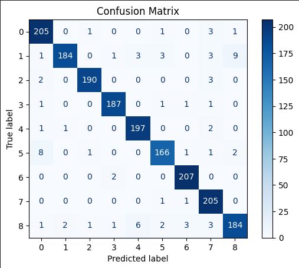
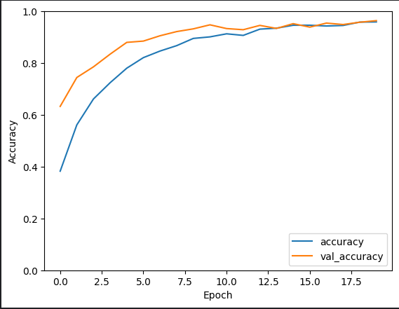
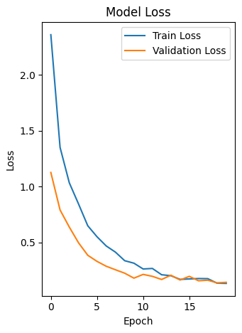

# Fish-Images-Classification-with-ANN

This project was developed as part of the Global AI Hub Deep Learning Project Bootcamp held between 7 October - 31 October 2024.

### Project Purpose 
The aim of this project is to develop a deep learning model that can accurately classify fish images species. The model takes fish images data as input and determines which species these images belong to.

### Project Overview 
One would think that CNN should be used in this project because dataset are images. However, in this project, which was developed under the bootcamp, ANN was requested to be used. This project can be considered as a project which introduction to ANNs. The best results were tried to be obtained with experimental methods without using complex structures. The parameters and structure have been successfully optimized.

In this project, as you can see on the [Operational Flow of the Code](#Operational-Flow-of-the-Code), dataset have been examinated, preproccessed and model train and test datasets are prepared. Dataset expansion methods have not been applied. A very simple model consisting of 4 layers has been created. Since the classes in the dataset are evenly distributed, the Accuracy performance metric was chosen.

### Dataset
In the project, the "A Large Scale Fish Dataset" dataset on the Kaggle platform was used. 

This dataset contains 9 different seafood types collected from a supermarket in Izmir, Turkey for a university-industry collaboration project at Izmir University of Economics, and this work was published in ASYU 2020. The dataset includes gilt head bream, red sea bream, sea bass, red mullet, horse mackerel, black sea sprat, striped red mullet, trout, shrimp image samples.

You can review the A Large-Scale Dataset for Fish Segmentation and Classification article written by the authors of the dataset from this [link](https://ieeexplore.ieee.org/abstract/document/9259867).

### Operational Flow of the Code
- **Importing**: It is the section where generally used libraries are imported. Some libraries have been imported in the areas where they are required.
- **Upload the dataset**: Uploading the data set consisting of pictures of fish species. Images of fish and their file paths were transferred to a list. A dataframe was created from these lists and this raw dataset was examined.
- **Convert Image Data to Numeric Data**: Since numeric inputs were needed, the image data was digitized and normalized.
- **Label Encoding and One-Hot Encoding for Class Labels** 
- **Data Normalization**
- **Creating Model**
- **Model Performance Examination**: Loss Visualization and Confusion Matrix was examined.

## Model Summary

Model: "**sequential**"

| Layer (type)          | Output Shape      | Param #      |
| ---------------       | --------------    | ----------   |
| dense (Dense)         | (None, 256)       |   3,145,984  │  
| dropout (Dropout)     | (None, 256)       |   0          |
| dense_1 (Dense)       | (None, 128)       |   32,896     |
| dropout_1 (Dropout)   | (None, 128)       |   0          |
| dense_2 (Dense)       | (None, 64)        |   8,256      |
| dropout_2 (Dropout)   | (None, 64)        |   0          |
| dense_3 (Dense)       | (None, 9)         |   585        |

Total params: 3,187,721 (12.16 MB)
Trainable params: 3,187,721 (12.16 MB)
Non-trainable params: 0 (0.00 B)

- **ReLu** was selected as a activation function in hidden layer and **softmax** for output layer.
- Optimizer is **Adam** and performance metric is **accuracy**.
- As a result of the trials, epoch was selected as **20** and batch size was selected as **64**.

 ### Model Performance

**Test Loss : 0.1439 Test Accuracy : 0.9638**

**These results indicate that the model performs well on the training data and is sufficiently consistent across the validation set.**

### Kaggle Source 
https://www.kaggle.com/code/ayenurtak/fish-images-classification-with-ann
